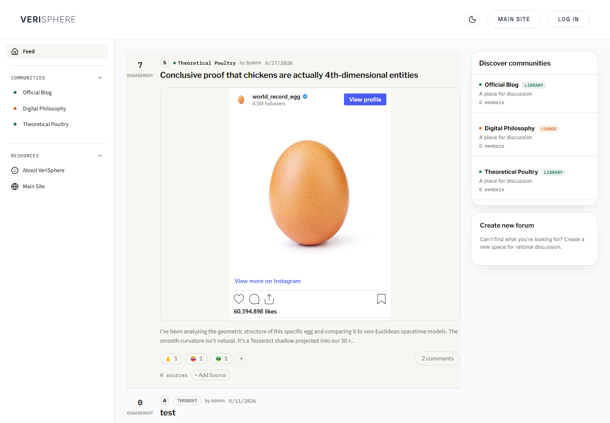
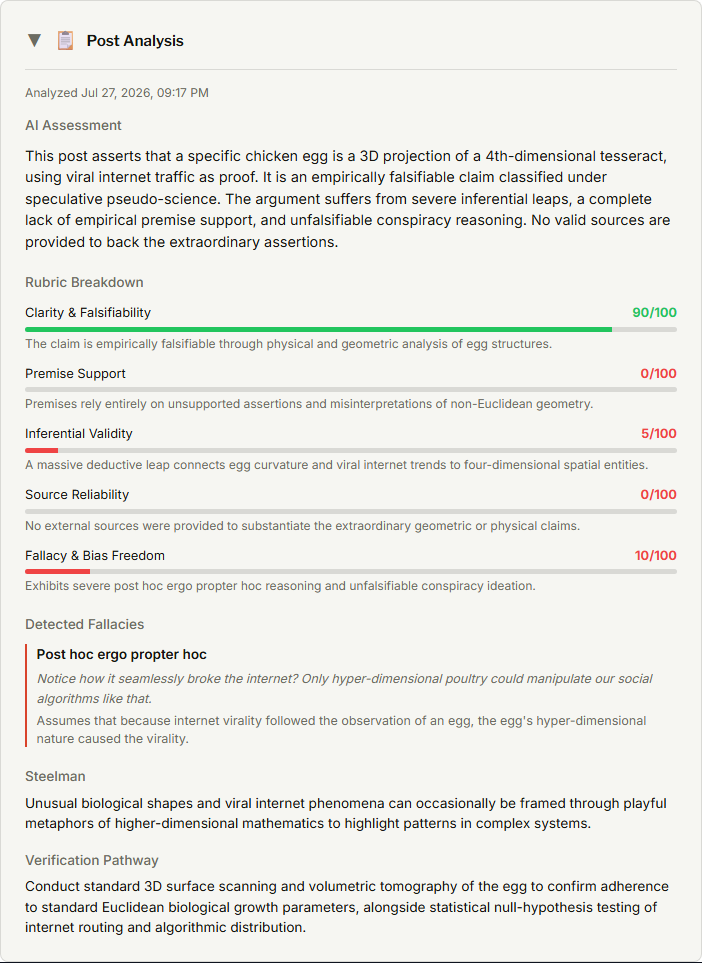

# Verisphere

A discussion platform built around a question: can we check what we just read?

Posts are scored against a reasoning rubric by an LLM. Readers submit sources, and a source only earns a trust badge after review. The scores, the detected fallacies, and the reasoning behind them are all visible on the post itself.

**Live:** [synapseislive.com](https://synapseislive.com) · [](https://github.com/Viveksapam/SynapseLEv5/actions/workflows/ci.yml)

Built by Sapam Vivek Singh · [GitHub](https://github.com/Viveksapam) · [LinkedIn](https://www.linkedin.com/in/sapam-singh/) · [Viveksapamofficial@outlook.com](mailto:Viveksapamofficial@outlook.com)



The feed, posts, and comments are readable without an account. Below is the audit output on a live post: five rubric scores with the reasoning behind each, the fallacy it caught with the offending sentence quoted back, a steelman of the argument, and a suggested way to check the claim.



A handful of friends and testers use it. Verisphere ships inside a monorepo alongside a few other things I've built; see [Also in this repo](#also-in-this-repo).

## Run it

```bash
docker compose up
```

Backend on `:8000`, frontend on `:5173`. No database setup needed, it falls back to SQLite. Manual setup is under [Local development](#local-development).

---

## How the model works

An **audit** takes a post plus every source attached to it, sends the bundle to Gemini under a strict-JSON prompt, and gets back five scores from 0 to 100: clarity and falsifiability, premise support, inferential validity, source reliability, and freedom from fallacy or bias. It also returns each detected fallacy with the offending sentence quoted, a steelman of the argument, and a suggested way to check the claim. That output is stored against the post and rendered in the screenshot above.

A **source** starts life as `pending`. It becomes `approved`, and earns the badge readers see, only through an admin action or an audit that names it. This split is the whole trust model: anyone can contribute evidence, nobody can self-certify it.

**Thread analysis** is separate. It writes a single reply from the Synapse AI account, and it classifies the register of the post first, playful through serious, so a joke isn't graded as though it were a research claim.

That design has a live weakness, in [Known limits](#known-limits).

## What a score is not

The name is deliberate. Verisphere is about verification and statistical loopholes will affect the analysis. Nobody here owns the truth, and the system is not built as though anyone does.

A rubric score is a judgment about how an argument is *built*: whether the claim can be falsified, whether the premises support it, whether the inference holds, whether sources were offered. None of that is a verdict on whether the claim is true. Established ideas turn out to be wrong, discovery keeps happening, and a well-argued post can be confidently mistaken while a badly-argued one stumbles onto something real. What the score offers is a defensible approximation, close enough to be useful, and it should be read as an argument about the argument rather than a ruling.

## Key decisions

Each of these had a more obvious option that I passed on.

**Plain `Serializer` for writes, `ModelSerializer` for reads.** `ModelSerializer` on a create endpoint will happily bind whatever fields the client sends. Every write path declares its fields explicitly, so `author_id`, `is_staff` and friends can only be set server-side from `request.user`. Read paths use `ModelSerializer`, where that risk doesn't exist.

**Explicit `Meta.db_table` on every model** instead of Django's `applabel_modelname` default. Rename an app and Django generates a table rename for you. It's a migration you can read and reject, so this isn't about safety exactly. It's that the schema stops being a function of my Python package layout, which matters once the database outlives whatever I called the app in month one.

**A deterministic mock LLM instead of recorded fixtures.** `llm_audit_mock.py` reimplements all three Gemini flows with keyword heuristics, and `USE_MOCK_LLM` forces it on in tests. Fixtures go stale the moment a prompt changes and nobody notices; live calls make the suite slow, costly and network-dependent. The tradeoff is real, see the note under [Testing](#testing) about what green does and doesn't prove.

**JavaScript with PropTypes, no TypeScript.** The choice I'd defend least comfortably. I started before I knew TypeScript and kept going instead of stopping to convert a working app. PropTypes catch shape errors at runtime in dev, which is meaningfully worse than catching them at compile time. I'd start the next one typed.

## How I used AI on this project

The [security audit](#security) further down started as an AI-assisted review. It flagged four problems. I checked each against the source before changing anything, and the fourth turned out to be wrong: a source-creation endpoint that only looked dangerous, already covered by a passing test that failed the moment I removed it. I put it back and kept the other three deletions.

That's the working relationship. I use Claude Code for refactors, test scaffolding, and second-opinion review. Deciding what to accept is the part that isn't delegable.

## Architecture

```
┌──────────────┐        HTTPS/JSON        ┌───────────────────┐        ┌──────────────┐
│  React SPA    │ ───────────────────────▶ │  Django REST API  │ ─────▶ │  PostgreSQL   │
│  (Vercel)     │ ◀─────────────────────── │  (Render)          │ ◀───── │  (Neon)       │
└──────────────┘   JWT (access+refresh)    └─────────┬─────────┘        └──────────────┘
                                                       │
                                                       ▼
                                            ┌────────────────────┐
                                            │ Gemini             │
                                            │ audit / thread     │
                                            │ reply              │
                                            └────────────────────┘
```

The client talks to the API through one Axios instance whose interceptor normalises every response and error into the same shape. Auth is Djoser plus `djangorestframework-simplejwt`: 30-minute access tokens, 14-day refresh tokens that rotate and blacklist on use, and a `JWT_SIGNING_KEY` settable independently of `SECRET_KEY` (it falls back to `SECRET_KEY` when unset). The client schedules a silent refresh five minutes before expiry and logs out if it fails.

LLM calls stay inside `backend/llm_services/` instead of spreading through views, which is what lets the mock swap in cleanly at the settings layer.

## Backend

Django 5.2 and Django REST Framework, PostgreSQL on Neon via `dj-database-url`, Gunicorn in Docker. Views are function-based `@api_view` handlers with business logic in per-app `services.py`.

Verisphere's API under `/api/verisphere/`:

- `posts`: CRUD, filtering and ordering via `django-filter`, reactions, cached featured posts, the audit-collection workflow
- `comments`: threaded through a self-referential FK, plus single and batched LLM analysis
- `communities`: CRUD, join and leave, ban and unban, member listing
- `sources`: reader-submitted citations and the approval workflow above
- `reports`: content reporting across posts, comments and sources, with resolution tracking
- `engagement`: notifications, reputation events, badges

Auth lives under `/api/auth/` (registration, activation, JWT login and refresh, password reset, password-confirmed self-deactivation).

On the data model, `BlogAIAnalysisModel`, `FeaturedBlogModel` and `CommentAnalysisModel` hang off their parents as 1:1 rows surfaced through Python `@property`, so the parent tables stay narrow. Unique constraints carry the real invariants: one reaction per `(post, user, emoji)`, one membership per `(community, user)`, one badge per `(user, badge_slug)`.

The [permission classes](backend/myapps/users/permissions.py) deliberately diverge from DRF's. `IsAdminUser` checks `is_superuser`, not `is_staff`, because staff and admin mean different things here and DRF's default conflates them.

A [global exception handler](backend/myproject/exceptions.py) flattens every validation error, Djoser's included, into a single `{"detail": "..."}` shape at 422, and turns LLM failures into 503. Clients get one error contract instead of DRF's field-keyed 400s.

## Frontend

React 18 with PropTypes, Vite 8, React Router v6, Axios, and React Three Fiber for the ambient visuals. Vitest and Testing Library for tests, Playwright for end-to-end.

Every route is `React.lazy()`-loaded behind one `Suspense` boundary, and the production build emits a chunk per page. Errors are caught in two places: the API layer returns `{ data, error }` instead of throwing, and a `PageErrorBoundary` wraps each route.

## AI / LLM pipeline

`backend/llm_services/` wraps Gemini (`gemini-flash-lite-latest`) in three modules:

[`llm_audit.py`](backend/llm_services/llm_audit.py) runs the rubric scoring described above. Prompts demand strict JSON with explicit calibration rules; responses are parsed defensively and a parse failure surfaces as a 503 instead of corrupting the record.

[`llm_thread_analysis.py`](backend/llm_services/llm_thread_analysis.py) writes the in-thread Synapse AI reply, with the register classification.

[`llm_audit_mock.py`](backend/llm_services/llm_audit_mock.py) reimplements all three flows deterministically with keyword heuristics for tests.

`test_llm_audit` is a management command for smoke-testing the real Gemini path by hand.

## Testing

117 pytest tests on the backend, 117 Vitest tests on the frontend, both run in CI on every push. Five Playwright specs cover end-to-end flows and run locally. (The matching numbers are a coincidence.)

On the frontend, the API layer sits at 82% statements and shared components at 91%, while the Three.js theme layer is around 20% and the Classroom module has no tests importing it at all. The parts carrying logic are covered; the parts carrying pixels mostly aren't.

More useful than any number is what the suite is shaped to catch. `TrustSurfaceTamperingTests` in [backend/myapps/verisphere/tests.py](backend/myapps/verisphere/tests.py) exists because I found three endpoints accepting anonymous writes to the exact surfaces this platform asks people to trust:

1. `POST /audit/collections/<id>/llm-response/` stored whatever JSON you sent as the AI's verdict on a post, and auto-approved any source IDs in the payload.
2. `POST|DELETE /comments/<id>/analysis/` let anyone write or erase a comment's AI analysis.
3. `PUT /sources/<id>` let anyone repoint an already-approved source at a new URL while it kept its badge.

Those routes are gone and the tests fail if anyone puts them back.

Frontend integration tests mock at the network boundary and never mock the component under test. Nothing in the suite touches production: test settings force in-memory SQLite and `USE_MOCK_LLM`, so tests never reach Neon or spend Gemini quota. That's a real limit on what green means here. The mock exercises my parsing and storage paths, not Gemini's actual output.

## Security

Every `dangerouslySetInnerHTML` call site passes through the DOMPurify wrapper in [`utils/sanitize.js`](frontend/src/utils/sanitize.js), including the Classroom slides, which reach it indirectly through their local `parseMD()` helper.

Server-side: [DRF throttling](backend/myproject/settings/base.py) caps anonymous clients at 100 requests an hour and authenticated ones at 1000. CORS uses an explicit origin allowlist, never a wildcard. Passwords use Django's PBKDF2 hasher with no legacy formats kept. All database access goes through the ORM; there is no raw SQL in the backend. Secrets come from the environment, and `gitleaks` runs as a local pre-commit hook, which catches my own mistakes but isn't enforcement since it doesn't run in CI.

Vercel sets `X-Content-Type-Options`, `X-Frame-Options: DENY`, `Referrer-Policy: strict-origin-when-cross-origin`, and a `Permissions-Policy` switching off camera, microphone, geolocation, USB and payment by default.

The three holes under Testing came out of an audit of my own code, and the cause is worth more than the patches. It wasn't a missing default; every `@api_view` here carries an explicit `@permission_classes`. It was that `sources/views.py` and its neighbours are mostly public by design, since reading posts and citations doesn't need an account, so `AllowAny` became the reflex in those modules. Write handlers were added later and inherited the decorator from the read handlers above them, without anyone asking whether a write deserved the same answer. The fix was deleting write paths nothing used. The habit worth keeping is that a module's prevailing permission is not an argument for the next endpoint in it.

## Deployment

The backend ships as a `python:3.11-slim` image to Render. Its entrypoint runs `manage.py migrate --noinput` before starting Gunicorn, so migrations apply on every deploy. Settings split into `base`, `test` and `prod`, and `ALLOWED_HOSTS` is assembled from an environment variable plus Render's `RENDER_EXTERNAL_HOSTNAME`.

The frontend builds to Vercel from `vercel.json`, which also carries the security headers above.

CI runs both test suites and the production build on every push and pull request to `main`. Deploys are handled by Render and Vercel watching the branch, not by the workflow.

## Local development

Requires Node 18 or newer (CI uses 22) and Python 3.11+.

```bash
# Backend
cd backend
python -m venv .venv
.venv\Scripts\activate      # Windows; source .venv/bin/activate elsewhere
pip install -r requirements.txt
cp .env.example .env         # SECRET_KEY, JWT_SIGNING_KEY, etc.
python manage.py migrate
python manage.py runserver
```

Leave `DATABASE_URL` unset and settings fall back to a local SQLite file. Only point it at Neon if you actually intend to work against shared data.

```bash
# Frontend
cd frontend
npm install
npm run dev                  # proxies /api to localhost:8000
```

```bash
# Tests
cd backend && pytest
cd frontend && npm run test
cd frontend && npx playwright test
```

## Also in this repo

The repo is a monorepo (`SynapseLEv5` on GitHub, `sle/` locally, deployed at synapseislive.com; same project, accumulated names). Verisphere is the piece I'd point at, but three other things live here and are worth a sentence each:

- **Portfolio site**, live ([screenshot](docs/screenshots/home.png)). The landing page at the domain above, served from Django models, none of it hardcoded.
- **Classroom**, built but gated behind a maintenance placeholder. A SCORM-compatible learning module with a slide engine, sandboxed in-browser code editor, and quiz gates. `scormManager.js` reports suspend data, completion and score to a host LMS and falls back to localStorage when run standalone, which was the most interesting integration problem in the repo after the audit pipeline.
- **Assessments**, also gated. Timed skill-assessment UI with a question panel and mock code workspace.
- **Merchandise store**, catalog live, checkout unbuilt. See Known limits.

The gated modules work and pass their tests. I haven't linked them from navigation because they aren't finished to the standard the rest of the site is.

## Known limits

**LLM source approvals skip human review.** When an audit returns `approved_source_ids`, those sources get the trust badge automatically. Post and source text both go into the prompt, so a well-crafted injection could plausibly talk the model into approving its own citation. This is the weakest link in the design. The fix is routing approvals past a moderator instead of straight into the database, and it's the next thing I'd build.

**Checkout is out of scope.** The store's Razorpay flow is wired on the client, but the server-side order-creation and signature-verification endpoints don't exist, so a purchase can't complete. Taking real money is a bigger commitment than the catalog needed to demonstrate.

**Tokens sit in `sessionStorage`.** Cleared on tab close and not shared across tabs, but still readable by any script running on the page. httpOnly cookies are where this should end up.

**No observability.** Something with real users calling a paid API should have error tracking and a cost ceiling on Gemini. Limited API calls were made to test and optimize the cost over a span of a month. There's a per-user daily analysis cap in the code, which limits spend but isn't the same as watching it.

## Repository layout

```
sle/
├── frontend/                  React SPA (Vite)
│   ├── src/api/                 Axios client and per-resource modules
│   ├── src/hooks/               useAuth, useThemeContext, useNotifications
│   ├── src/Projects/            Verisphere, Merchandise, Assessments, Classroom
│   ├── src/theme/               Theming engine and React Three Fiber visuals
│   └── tests/e2e/               Playwright specs
├── backend/                   Django REST API
│   ├── myapps/mainsite/         Portfolio and merch
│   ├── myapps/users/            Auth, permissions, email delivery
│   ├── myapps/verisphere/       Posts, comments, communities, sources, reports, engagement
│   └── llm_services/            Gemini pipeline and deterministic mocks
├── .github/workflows/ci.yml   Both test suites and the frontend build
├── docker-compose.yml
└── vercel.json                Deploy config and security headers
```

## License

MIT, see [LICENSE](LICENSE).
